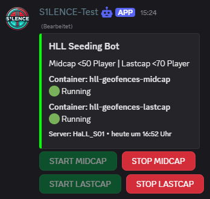

# HLL Geofences for Advanced Seeding

This repository provides scripts for managing seeding configurations for Hell Let Loose (HLL) servers using geofencing. It supports two configurations: **Midcap Seeding** (midcap-only gameplay) and **Last Cap Seeding** (last capture point blocked). The scripts can be deployed using Docker and optionally controlled via a Discord bot.

## Features

- Configurable player count thresholds for geofencing.
- Docker-based deployment for easy setup and management.
- Optional Discord bot integration for remote control.
- Supports both midcap and last cap seeding configurations.




## Prerequisites

- Git
- Docker (for deployment)
- Node.js and npm (for Discord bot)
- Access to HLL server RCON (IP, port, password)

## Express Installation

For a quick setup that skips manual configuration of most files, you can use the provided installation script. This method bypasses all configuration steps up to the optional Discord bot setup, but it is recommended to review the `.env` file to customize the warning and punish messages.

1. **Clone the Repository**:
   ```bash
   git clone https://github.com/2KU77B0N3S/hll-geofences
   cd hll-geofences
   ```

2. **Run the Installation Script**:
   - Execute the installation script from the root directory:
     ```bash
     bash install_hll_geofences.sh
     ```
   - The script automatically handles the setup of environment files, Docker configuration, and default seeding configurations.

3. **Check the `.env` File**:
   - Open the `.env` file in the root directory using a text editor (e.g., `vi` or `nano`):
     ```bash
     nano .env
     ```
   - Verify and customize the warning and punish messages as needed. Ensure other required parameters (e.g., Discord bot token, channel ID) are set if you plan to use the Discord bot.

4. **Start Docker Container**:
   - Start the container in detached mode:
     ```bash
     docker compose up -d
     ```

**Note**: After running the script, you can proceed to the [Optional: Discord Bot Setup](#optional-discord-bot-setup) section if you want to enable Discord bot control. Ensure you review the `.env`, `seeding.midcap.yml`, and `seeding.lastcap.yml` files if you need to adjust server-specific settings (e.g., `SERVER-IP`, `RCON-PORT`, `RCON-PW`) later.

## Installation

Follow these steps to set up the HLL geofencing scripts.

1. **Clone the Repository**:
   ```bash
   git clone https://github.com/2KU77B0N3S/hll-geofences
   cd hll-geofences
   ```

2. **Configure Environment File**:
   - Rename the example environment file:
     ```bash
     mv seeding.example.env .env
     ```
   - Edit `.env` using a text editor (e.g., `vi` or `nano`) and fill in the required parameters (e.g., Discord bot token, channel ID).

3. **Set Up Docker**:
   - Rename the Docker configuration file:
     ```bash
     mv seeding.docker-compose.yml docker-compose.yml
     ```

4. **Configure Midcap Seeding**:
   - Edit the midcap configuration file:
     ```bash
     vi seeding.midcap.yml
     ```
     or
     ```bash
     nano seeding.midcap.yml
     ```
   - Fill in `SERVER-IP`, `RCON-PORT`, and `RCON-PW`.
   - Optional: Adjust the "player less than" threshold to set the desired player count for geofencing.

5. **Configure Last Cap Seeding**:
   - Edit the last cap configuration file:
     ```bash
     vi seeding.lastcap.yml
     ```
     or
     ```bash
     nano seeding.lastcap.yml
     ```
   - Fill in `SERVER-IP`, `RCON-PORT`, and `RCON-PW`.
   - Optional: Adjust the "player less than" threshold to set the desired player count for geofencing.

6. **Build Docker Image**:
   - Build the Docker image (required after any file changes):
     ```bash
     docker compose build
     ```

7. **Start Docker Container**:
   - Start the container in detached mode:
     ```bash
     docker compose up -d
     ```

8. **Stop Docker Container** (when needed):
   ```bash
   docker compose down
   ```

## Optional: Discord Bot Setup

To manage Docker instances via Discord, set up the JavaScript-based Discord bot.

1. **Install Dependencies**:
   In the root directory, run:
   ```bash
   npm install
   ```

2. **Start the Discord Bot**:
   ```bash
   node seeding.main.mjs
   ```

## Notes

- Ensure `.env`, `seeding.midcap.yml`, and `seeding.lastcap.yml` are correctly configured before starting.
- Run `docker compose build` after modifying any configuration files or Docker-related files to apply changes.
- The Discord bot is optional and can be skipped if not needed.
- For persistent script execution, consider using a process manager like PM2

## Managing Docker Instances

- **Check Container Status**:
  ```bash
  docker ps
  ```
- **View Logs**:
  ```bash
  docker compose logs
  ```
- **Restart Container**:
  ```bash
  docker compose restart
  ```

## Contributing

For issues, feature requests, or contributions, please open an issue or submit a pull request on the [GitHub repository](https://github.com/2KU77B0N3S/hll-geofences).
